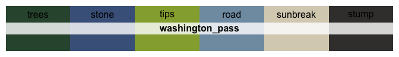
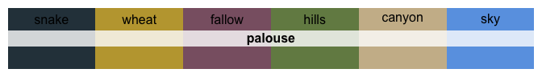
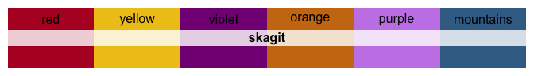
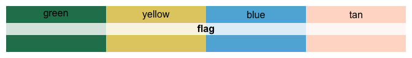

<!-- README.md is generated from README.Rmd. Please edit that file -->

# Colorblind-friendly Palettes from Washington State

<!-- badges: start -->
<!-- badges: end -->


About the package…

## Installation

<!-- You can install the released version of wacolors from [CRAN](https://CRAN.R-project.org) with: -->

You can install `wacolors` from GitHub with:

``` r
devtools::install_github("CoryMcCartan/github")
```

## Usage

``` r
library(wacolors)

# See all palettes
names(wacolors)
#>  [1] "rainier"         "rainier_meadow"  "larch"           "understory"     
#>  [5] "understory_cont" "seattle_night"   "seattle_fall"    "pike_place"     
#>  [9] "fort_worden"     "chambers_bay"    "stuart"          "sound_sunset"   
#> [13] "washington_pass" "winthrop"        "ross_lake"       "winter_mountain"
#> [17] "library"         "ferries"         "volcano"         "locks"          
#> [21] "deception_pass"  "scrubland"       "palouse"         "grand_coulee"   
#> [25] "chihuly"         "plane_view"      "UW"              "flag"           
#> [29] "tartan"
```

## The Palettes

### Continuous Palettes

<!-- --><!-- --><!-- --><!-- --><!-- --><!-- --><!-- -->

### All Palettes

<!-- --><!-- --><!-- --><!-- --><!-- --><!-- --><!-- --><!-- --><!-- --><!-- --><!-- --><!-- --><!-- --><!-- --><!-- --><!-- --><!-- --><!-- --><!-- --><!-- --><!-- --><!-- --><!-- --><!-- --><!-- --><!-- --><!-- --><!-- --><!-- -->
