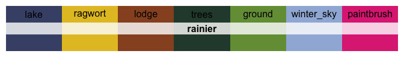
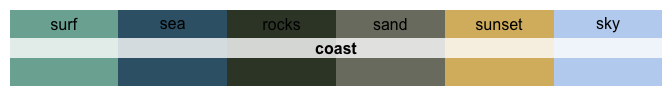
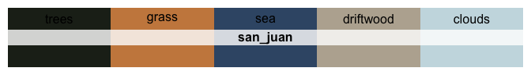

<!-- README.md is generated from README.Rmd. Please edit that file -->

# Colorblind-friendly Palettes from Washington State

<!-- badges: start -->

[](https://github.com/CoryMcCartan/wacolors/actions)
<!-- badges: end -->


The `wacolor` package contains 30 color palettes taken from the
landscapes and cities of Washington state. Each color was extracted from
a photograph, with minor alterations made to improve balance and
desaturability. The palettes were evaluated by the color-blind author to
ensure colors are distinguishable, but some palettes risk more confusion
than others, especially at small scales.

## Installation

<!-- You can install the released version of wacolors from [CRAN](https://CRAN.R-project.org) with: -->

You can install `wacolors` from GitHub with:

``` r
devtools::install_github("CoryMcCartan/wacolors@release")
```

## Usage

It’s easy to select a palette. Access palettes through `wacolors$...`
for autocompletion suggestions.

``` r
library(wacolors)
library(ggplot2)

# See all palettes
names(wacolors)
#>  [1] "rainier"         "rainier_meadow"  "larch"           "forest"         
#>  [5] "understory"      "seattle_night"   "seattle_fall"    "pike_place"     
#>  [9] "fort_worden"     "chambers_bay"    "stuart"          "sound_sunset"   
#> [13] "washington_pass" "winthrop"        "forest_fire"     "ross_lake"      
#> [17] "winter_mountain" "library"         "ferries"         "volcano"        
#> [21] "locks"           "deception_pass"  "scrubland"       "palouse"        
#> [25] "grand_coulee"    "chihuly"         "plane_view"      "UW"             
#> [29] "flag"            "tartan"

# See one palette
wacolors$rainier
#>    ground      lake      rock     trees     lodge fall_bush   glacier 
#> "#6D9537" "#364B6F" "#9C9DB0" "#2A4E45" "#7F4E28" "#E59A20" "#D4D8E2"
```

The package comes with `ggplot2`-compatible scales which are easy to
use.

``` r
# access by name
ggplot(mtcars, aes(mpg, wt)) +
    geom_point(aes(color = factor(cyl), size=hp)) +
    scale_color_wa_d("seattle_night")
```


``` r
# or access using `wacolors$...`
ggplot(diamonds) +
    geom_bar(aes(x = cut, fill = clarity)) +
    scale_fill_wa_d(wacolors$sound_sunset, reverse=TRUE)
```


You can use the `wa_pal` function to directly construct a
discretized/binned color scale.

``` r
image(volcano, col=wa_pal("ferries", 12))
```


``` r
image(volcano, col=wa_pal("volcano", 80, reverse=TRUE))
```


### Code Generation

In case you do not wish to have `wacolors` as a dependency, you may use
the `pal_vector()` and `pal_functions()` functions, which generate
self-contained code for using the palettes. When using RStudio, this
code will be loaded, ready to copy, at the console prompt.

``` r
pal_vector("sound_sunset", 15)
#> PAL_SOUND_SUNSET = c("#41527A", "#4C5F84", "#586D8F", "#627898", "#6C82A0",
#>                      "#778AA4", "#838EA0", "#90929C", "#9D9490", "#AB9885",
#>                      "#BC9E7F", "#D0A77C", "#E0B47E", "#EBCB8A", "#F6E297")

pal_functions("locks")
#> scale_color_locks_d = function(...) {
#>   pal_cols = c("#384230", "#6FB866", "#ABCF9F")
#>   n_col = length(pal_cols)
#>   ramp = grDevices::colorRampPalette(pal_cols)
#>   pal_fun = ramp
#>   discrete_scale("color", "locks", palette=pal_fun, ...)
#> }
#> scale_fill_locks_d = function(...) {
#>   pal_cols = c("#384230", "#6FB866", "#ABCF9F")
#>   n_col = length(pal_cols)
#>   ramp = grDevices::colorRampPalette(pal_cols)
#>   pal_fun = ramp
#>   discrete_scale("fill", "locks", palette=pal_fun, ...)
#> }
#> 
#> scale_color_locks_c = function(...) {
#>   scale_color_gradientn(..., colours=c("#384230", "#6FB866", "#ABCF9F"))
#> }
#> scale_fill_locks_c = function(...) {
#>   scale_fill_gradientn(..., colours=c("#384230", "#6FB866", "#ABCF9F"))
#> }
#> 
#> 
```

## The Palettes

### Continuous Palettes

<!-- --><!-- --><!-- --><!-- --><!-- --><!-- --><!-- -->

### All Palettes

<!-- --><!-- --><!-- --><!-- --><!-- --><!-- --><!-- --><!-- --><!-- --><!-- --><!-- --><!-- --><!-- --><!-- --><!-- --><!-- --><!-- --><!-- --><!-- --><!-- --><!-- --><!-- --><!-- --><!-- --><!-- --><!-- --><!-- --><!-- --><!-- --><!-- -->
