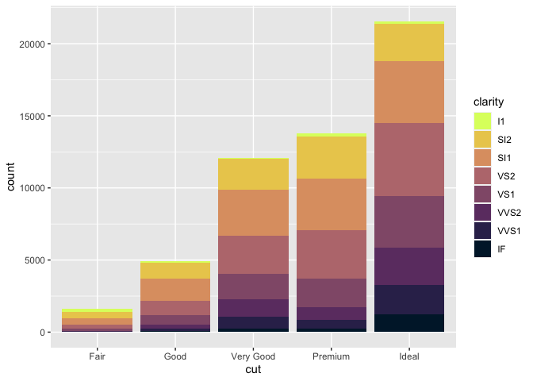
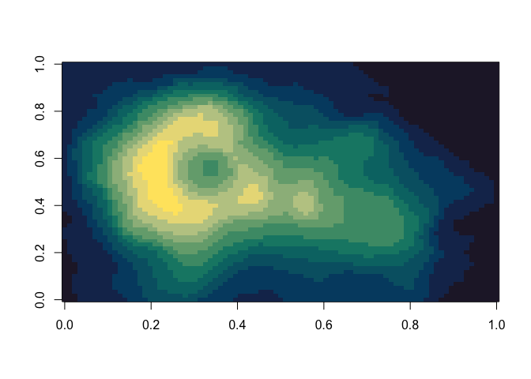
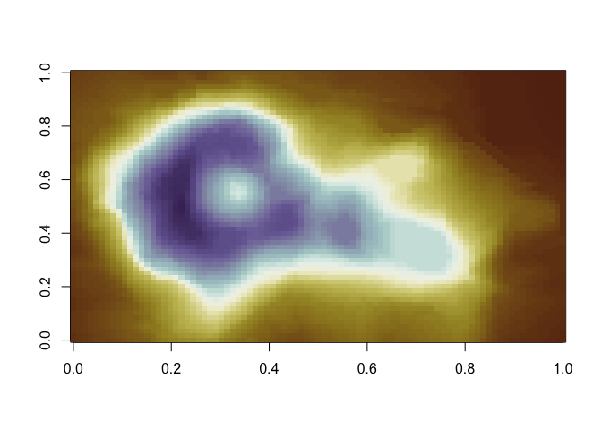
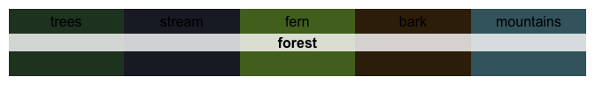
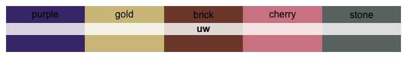

<!-- README.md is generated from README.Rmd. Please edit that file -->

# Colorblind-friendly Palettes from Washington State

<!-- badges: start -->

[](https://github.com/CoryMcCartan/wacolors/actions)
<!-- badges: end -->


The `wacolor` package contains 23 color palettes taken from the
landscapes and cities of Washington state. Colors were extracted from a
set of photographs, and then combined to form a set of continuous and
discrete palettes. Continuous palettes were designed to be perceptually
uniform, while discrete palettes were chosen to maximize contrast at
several different levels of overall brightness and saturation. Each
palette has been evaluated to ensure colors are distinguishable by
colorblind people.

Discrete palettes contain at most seven colors. Don’t create graphics
that use more than seven discrete colors. You can color a map with four.
Anything more risks confusion. Consider differentiating through faceting
or labels, instead.

## Installation

<!-- You can install the released version of wacolors from [CRAN](https://CRAN.R-project.org) with: -->

You can install `wacolors` from GitHub with:

``` r
devtools::install_github("CoryMcCartan/wacolors@release")
```

## Usage

It’s easy to select a palette. Access palettes through `wacolors$...`
for autocompletion suggestions.

``` r
library(wacolors)
library(ggplot2)

# See all palettes
names(wacolors)
#>  [1] "rainier"         "washington_pass" "palouse"         "forest"         
#>  [5] "larch"           "coast"           "uw"              "fort_worden"    
#>  [9] "skagit"          "flag"            "sound_sunset"    "ferries"        
#> [13] "forest_fire"     "sea"             "sea_star"        "volcano"        
#> [17] "baker"           "diablo"          "mountains"       "gorge"          
#> [21] "foothills"       "olympic"         "vantage"

# See one palette
wacolors$rainier
#>       lake    ragwort      lodge      trees     ground winter_sky paintbrush 
#>  "#465177"  "#E4C22B"  "#965127"  "#29483A"  "#759C44"  "#9FB6DA"  "#DF3383"
```

The package comes with `ggplot2`-compatible scales which are easy to
use.

``` r
# access by name
ggplot(mtcars, aes(mpg, wt)) +
    geom_point(aes(color = factor(cyl), size=hp)) +
    scale_color_wa_d("rainier")
```

<!-- -->

``` r
# or access using `wacolors$...`
ggplot(diamonds) +
    geom_bar(aes(x = cut, fill = clarity)) +
    scale_fill_wa_d(wacolors$sound_sunset, reverse=TRUE)
```

<!-- -->

You can use the `wa_pal` function to directly construct a
discretized/binned color scale.

``` r
image(volcano, col=wa_pal("ferries", 12))
```

<!-- -->

``` r
image(volcano, col=wa_pal("vantage", 200, reverse=TRUE))
```

<!-- -->

### Code Generation

In case you do not wish to have `wacolors` as a dependency, you may use
the `pal_vector()` and `pal_functions()` functions, which generate
self-contained code for using the palettes. When using RStudio, this
code will be loaded, ready to copy, at the console prompt.

``` r
pal_vector("sound_sunset", 15)
#> PAL_SOUND_SUNSET = c("#001E35", "#0E2648", "#342C59", "#523368", "#6D3D71",
#>                      "#804C73", "#925B78", "#A16C7B", "#BB797D", "#D08B79",
#>                      "#DE9F71", "#E6B465", "#EBCC5B", "#E6E55B", "#DCFF6C")

pal_functions("palouse")
#> scale_color_palouse_d = function(...) {
#>   pal_cols = c("#2D3F4A", "#C0A43D", "#8A6172", "#748A52", "#CCBA98",
#>                "#69A2E4")
#>   n_col = length(pal_cols)
#>   ramp = grDevices::colorRampPalette(pal_cols)
#>   pal_fun = function(n) if (n <= n_col) pal_cols[1:n] else ramp(n)
#>   discrete_scale("color", "palouse", palette=pal_fun, ...)
#> }
#> scale_fill_palouse_d = function(...) {
#>   pal_cols = c("#2D3F4A", "#C0A43D", "#8A6172", "#748A52", "#CCBA98",
#>                "#69A2E4")
#>   n_col = length(pal_cols)
#>   ramp = grDevices::colorRampPalette(pal_cols)
#>   pal_fun = function(n) if (n <= n_col) pal_cols[1:n] else ramp(n)
#>   discrete_scale("fill", "palouse", palette=pal_fun, ...)
#> }
#> 
#> scale_color_palouse_c = function(...) {
#>   scale_color_gradientn(..., colours=c("#2D3F4A", "#C0A43D", "#8A6172",
#>                         "#748A52", "#CCBA98", "#69A2E4"))
#> }
#> scale_fill_palouse_c = function(...) {
#>   scale_fill_gradientn(..., colours=c("#2D3F4A", "#C0A43D", "#8A6172",
#>                        "#748A52", "#CCBA98", "#69A2E4"))
#> }
#> 
#> 
```

## The Palettes

### Continuous Palettes

<!-- --><!-- --><!-- --><!-- --><!-- --><!-- --><!-- --><!-- --><!-- --><!-- --><!-- --><!-- --><!-- -->

### Discrete Palettes

<!-- --><!-- --><!-- --><!-- --><!-- --><!-- --><!-- --><!-- --><!-- --><!-- -->
